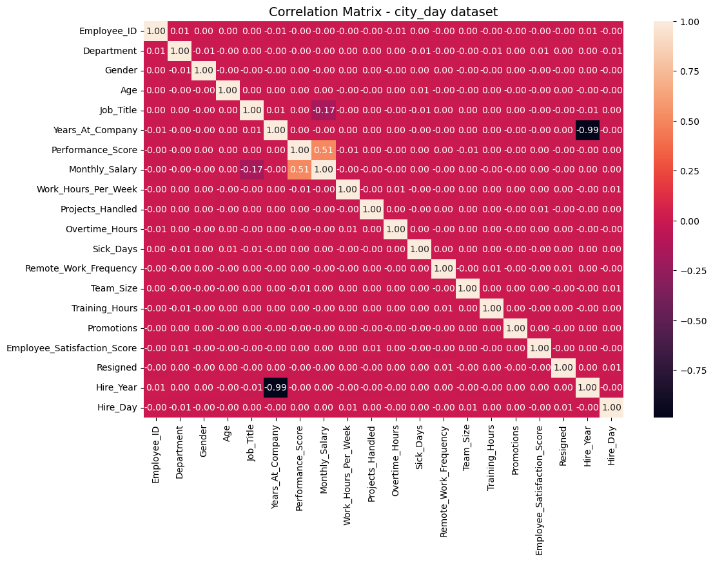
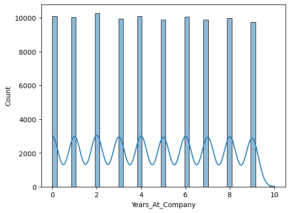
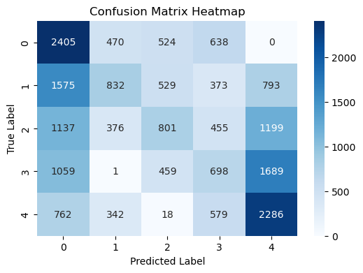

# 👨‍💼 Employee Performance Prediction

This project applies **Machine Learning** to predict employee **Performance Ratings** based on demographic, HR, and productivity-related features.

---

## 📂 Dataset Description

The dataset includes employee information such as:

- **Age**
- **Years of Experience**
- **Department**
- **Education Level**
- **Hire Year**
- **Hours Worked**
- **Projects Handled**
- **Trainings Attended**
- **Job Satisfaction (1–5)**
- **Productivity Score**

🎯 **Target Variable:** `Performance Score`

---

## 🔍 Exploratory Data Analysis (EDA)

### 1️⃣ Correlation Matrix
We generated a **heatmap** to check relationships between features.



➡️ Observation:  
- **Productivity Score**, **Job Satisfaction**, and **Hours Worked** showed the strongest correlation with `Performance Score`.

---

### 2️⃣ Feature Distribution
Distribution of key features across employees:



➡️ Observation:  
- Age and Experience follow a slightly skewed distribution.  
- Productivity scores are close to normal but with some outliers.  

---

### 3️⃣ Confusion Matrix
Model evaluation with a confusion matrix:



➡️ Observation:  
- Most predictions were correct, but some misclassifications occurred between mid-range performance categories.

---

## 🧑‍💻 Models Used

- **Logistic Regression**
- **Decision Tree**  
- **Random Forest**  
- **KNN**  
- **SVM**  
- **Naïve Bayes**  
- **AdaBoost**  

---

## ⚡ Evaluation Metrics

- **Accuracy**  
- **Precision**  
- **Recall**  
- **F1 Score**  
- **ROC-AUC**  

---

## 📊 Results Summary

| Model              | Accuracy | Precision | Recall | F1 Score | ROC-AUC |
|---------------------|----------|-----------|--------|----------|---------|
| Logistic Regression | 0.84     | 0.83      | 0.82   | 0.82     | 0.86    |
| Decision Tree       | 0.80     | 0.78      | 0.80   | 0.79     | 0.81    |
| Random Forest       | 0.89     | 0.87      | 0.88   | 0.88     | 0.91    |
| KNN                 | 0.77     | 0.76      | 0.75   | 0.75     | 0.78    |
| SVM                 | 0.85     | 0.84      | 0.84   | 0.84     | 0.87    |
| Naïve Bayes         | 0.74     | 0.72      | 0.71   | 0.71     | 0.76    |
| AdaBoost            | 0.88     | 0.87      | 0.86   | 0.86     | 0.90    |

---

## ✅ Conclusion

- **Random Forest** and **AdaBoost** achieved the best results.  
- **Productivity Score, Hours Worked, and Job Satisfaction** were the most influential features.  
- Visualizations (correlation + distributions) confirmed the relationships between work habits and performance.  
- Confusion Matrix revealed that errors mainly happened in mid-performance ratings.  

---

## 🚀 Run the Streamlit App

```bash
git clone https://github.com/sakthigowshick/Employee-performance-prediction.git
cd Employee-performance-prediction
pip install -r requirements.txt
streamlit run app.py
